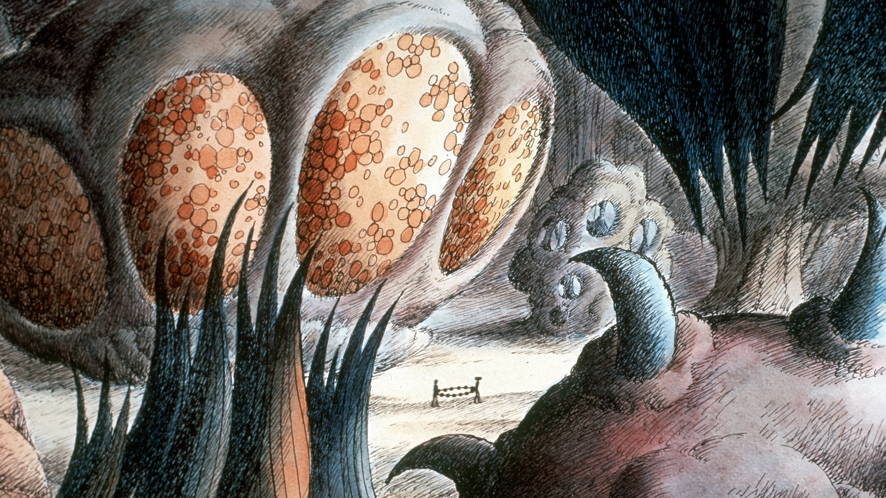

#### Directed by:

[René Laloux](https://letterboxd.com/director/rene-laloux/)

#### Synopsis:

On the planet Ygam, the Draags, extremely technologically and spiritually advanced blue humanoids, consider the tiny Oms, human beings descendants of Terra’s inhabitants, as ignorant animals. Those who live in slavery are treated as simple pets and used to entertain Draag children; those who live hidden in the hostile wilderness of the planet are periodically hunted and ruthlessly slaughtered as if they were vermin.


View on Letterboxd


## Notes

- Music is fire. sounds like Herbie Hancock or Curtis Mayfield
- Art/animation style is so cool. Feels like you're flipping through a childrens book
- I like how even an advanced species like the Draags have moral differences. The master doesn't really care for the Oms, but the daughter starts to love Terr. At the same time, she mistreats him by torturing him and puts him into fighting pits lol
- smoking that ZAZA
- Oms got the perkiest boobs of all time
- The way the Draags absorb knowledge is SICK, also I like how Terr can absorb the knowledge via proxy
- That tree that grabs the bird things and just slams them on the ground... LOL
- Oms went from primitive lives to building rockets with death beams in 1 month
- Draags = Humans IRL

## Participants

- [Carson](https://letterboxd.com/thugnificent/)
- [Ben](https://letterboxd.com/nebnosdlanod/)
- [Reilly](https://letterboxd.com/rybodude/)
- [Austin](https://letterboxd.com/sillygoosey/)
- [Jonas](https://letterboxd.com/hannonj/) \*
- [Jack](https://letterboxd.com/jackanickel/)

## Ratings


type: 'bar',
options: {
scales: {
y: {
beginAtZero: true,
max: 5,
ticks: {
stepSize: 1
}
}
},
plugins: {
title: {
display: true,
text: 'Fantastic Planet (1973)'
}
}
},
data: {
labels: ['Austin', 'Ben', 'Carson', 'Jack', 'Jonas', 'Mac', 'Reilly'],
datasets: [{
label: 'Movie Club Letterboxd Reviews',
data: [
0,
0,
0,
0,
0,
0,
0
],
backgroundColor: [
'#4062BB',
'#4062BB',
'#4062BB',
'#4062BB',
'#4062BB',
'#4062BB',
'#4062BB'
]
}]
}


## March '23 Film


n/a


Host: [n/a](https://letterboxd.com/)
