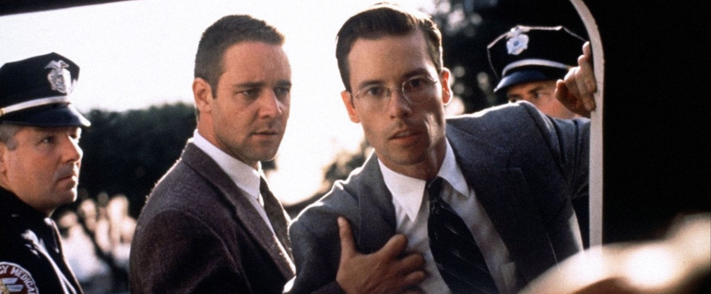

#### Directed by:

Curtis Hanson

#### Synopsis:

Three detectives in the corrupt and brutal L.A. police force of the 1950s use differing methods to uncover a conspiracy behind the shotgun slayings of the patrons at an all-night diner.


View on Letterboxd


## Notes

- Guy Pearce looks like young Val Kilmer
- I thought for sure that the actor playing Captain Dudley was Irish... come to find out he is born and raised American. If you closed your eyes while he spoke he sounds just like Liam Neeson I swear
- The scene in the beginning where Bud is talking to Pearce Patchett and the garage door is going down and you can see Bud through the cracks... 🤌🤌🤌
- The scene where Ed mistakes the actress for a hooker in the bar is hilarious
- That rain storm in LA? c'mon now...

## Participants

- [Carson](https://letterboxd.com/thugnificent/) *
- [Ben](https://letterboxd.com/nebnosdlanod/)
- [Reilly](https://letterboxd.com/rybodude/)
- [Austin](https://letterboxd.com/sillygoosey/)
- [Jonas](https://letterboxd.com/hannonj/)
- [Jack](https://letterboxd.com/jackanickel/)

## Ratings


type: 'bar',
options: {
scales: {
y: {
beginAtZero: true,
max: 5,
ticks: {
stepSize: 1
}
}
},
plugins: {
title: {
display: true,
text: 'L.A. Confidential (1997)'
}
}
},
data: {
labels: ['Austin', 'Ben', 'Carson', 'Jack', 'Jonas', 'Mac', 'Reilly'],
datasets: [{
label: 'Movie Club Letterboxd Reviews',
data: [
4.5,
5,
4.5,
0,
4,
4,
4
],
backgroundColor: [
'#4062BB',
'#4062BB',
'#4062BB',
'#4062BB',
'#4062BB',
'#4062BB',
'#4062BB'
]
}]
}


## February '23 Film


Fantastic Planet (1973)


Host: [Jonas](https://letterboxd.com/hannonj/)
