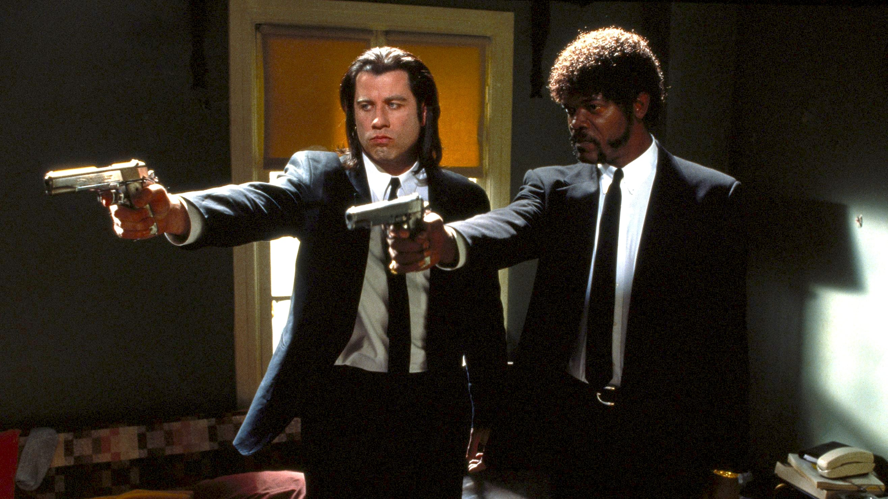

#### Directed by:

Quentin Tarantino

#### Synopsis:

A burger-loving hit man, his philosophical partner, a drug-addled gangster’s moll and a washed-up boxer converge in this sprawling, comedic crime caper. Their adventures unfurl in three stories that ingeniously trip back and forth in time.


View on Letterboxd


## Notes

## Participants

- ** Ben**
- Carson
- Reilly
- Austin
- Jonas

## Rating


type: 'bar',
options: {
scales: {
y: {
beginAtZero: true,
max: 5,
ticks: {
stepSize: 1
}
}
},
plugins: {
title: {
display: true,
text: 'Pulp Fiction (1994)'
}
}
},
data: {
labels: ['Austin', 'Carson', 'Reilly', 'Ben', 'Jonas', 'Mac'],
datasets: [{
label: 'Movie Club Letterboxd Reviews',
data: [0, 0, 0, 0, 0, 0],
backgroundColor: [
'#3B82F6',
'#3B82F6',
'#3B82F6',
'#3B82F6',
'#3B82F6',
'#3B82F6',
]
}]
}


## December '22 Film


n/a


Host: n/a
